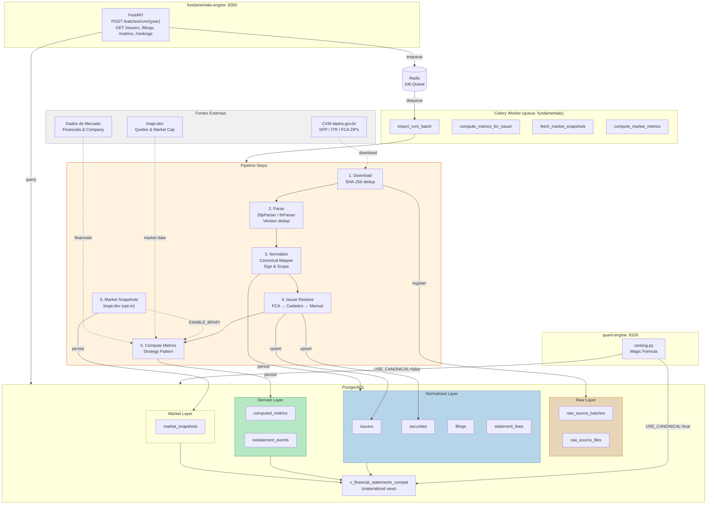
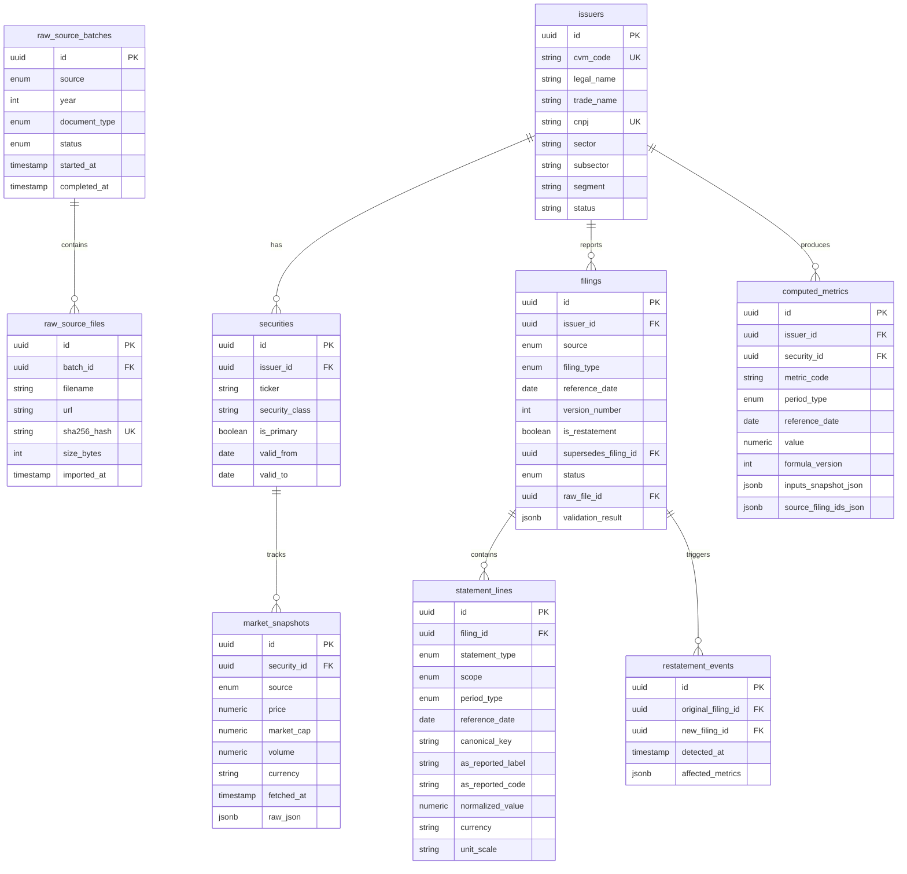
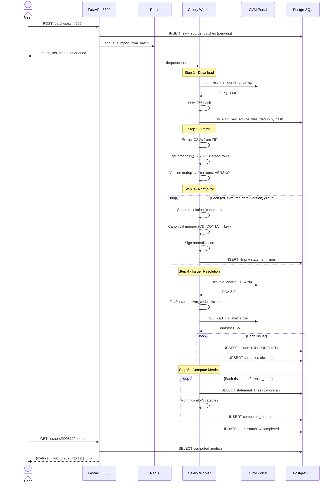
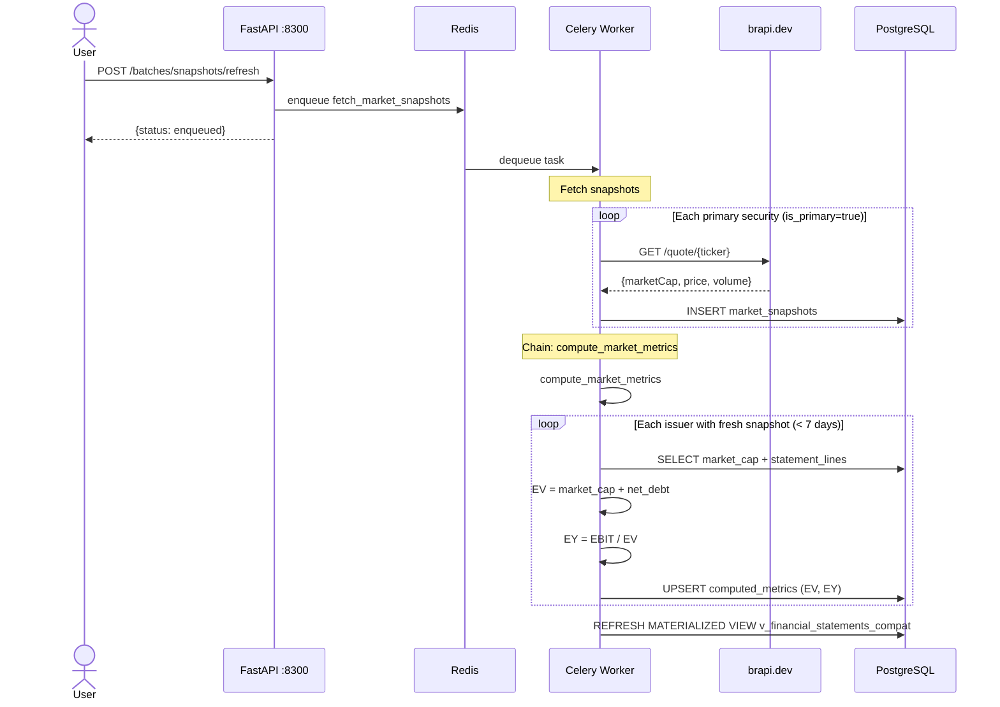

# Fundamentals Engine

Pipeline de dados fundamentalistas CVM com arquitetura em 3 camadas (Raw -> Normalized -> Derived).

## Diagrama do Sistema



## Diagrama ER (Tabelas)



## Fluxo de Dados Detalhado



### Market Snapshots Flow



## Arquitetura

```
POST /batches/cvm/{year}
       |
       v
  [Celery Worker: import_cvm_batch]
       |
       +-- 1. Download ZIPs da CVM (DFP/ITR/FCA)
       |       SHA-256 hash para dedup
       |       -> raw_source_batches / raw_source_files
       |
       +-- 2. Parse CSVs (Template Method + Factory)
       |       DfpParser / ItrParser / FcaParser
       |       Version dedup (VERSAO mais recente)
       |       -> ParsedRow[] em memoria
       |
       +-- 3. Normalize (Canonical Mapper)
       |       CD_CONTA CVM -> canonical_key interno
       |       Scope resolution (con > ind)
       |       Sign normalization (COGS negativo)
       |       -> filings / statement_lines
       |
       +-- 4. Issuer/Ticker Resolution (Chain of Resp.)
       |       FCA -> Cadastro -> ManualOverride
       |       -> issuers / securities
       |
       +-- 5. Compute Metrics (Strategy Pattern)
               EBITDA, Net Debt, ROIC, EY, Margins
               Auditavel: formula_version + inputs_snapshot
               -> computed_metrics
```

## Tabelas (9 novas, sem tenant_id)

### Raw Layer

| Tabela | Descricao |
|--------|-----------|
| `raw_source_batches` | Batch de download (source, year, doc_type, status) |
| `raw_source_files` | Arquivo baixado (filename, sha256, size_bytes) |

### Normalized Layer

| Tabela | Descricao |
|--------|-----------|
| `issuers` | Emissor CVM (cvm_code UNIQUE, cnpj UNIQUE, legal_name, sector) |
| `securities` | Ticker de um emissor (issuer_id FK, ticker, is_primary, valid_from/to) |
| `filings` | Demonstracao financeira (issuer_id FK, filing_type, reference_date, version) |
| `statement_lines` | Linha contabil (filing_id FK, canonical_key, normalized_value, scope) |

### Derived Layer

| Tabela | Descricao |
|--------|-----------|
| `computed_metrics` | Indicador calculado (issuer_id FK, metric_code, value, formula_version, inputs_snapshot) |
| `restatement_events` | Retificacao detectada (original_filing_id, new_filing_id, affected_metrics) |

### Market Layer

| Tabela | Descricao |
|--------|-----------|
| `market_snapshots` | Quote point-in-time (security_id FK, source, price, market_cap, volume, fetched_at, raw_json) |

### Compatibility View

`v_financial_statements_compat` - Materialized view que projeta dados canonicos em colunas compativeis com o modelo antigo (`assets` + `financial_statements`). Usada pelo quant-engine quando `USE_CANONICAL_FUNDAMENTALS=true`.

## Canonical Keys (CVM CD_CONTA -> interno)

```
KEY                      CVM      STMT    DESCRICAO
revenue                  3.01     DRE     Receita Liquida
cost_of_goods_sold       3.02     DRE     Custo dos Bens/Servicos
gross_profit             3.03     DRE     Resultado Bruto
operating_expenses       3.04     DRE     Despesas Operacionais
ebit                     3.05     DRE     EBIT
financial_result         3.06     DRE     Resultado Financeiro
ebt                      3.07     DRE     EBT
income_tax               3.08     DRE     IR/CSLL
net_income               3.11     DRE     Lucro Liquido
total_assets             1        BPA     Ativo Total
current_assets           1.01     BPA     Ativo Circulante
cash_and_equivalents     1.01.01  BPA     Caixa e Equivalentes
non_current_assets       1.02     BPA     Ativo Nao Circulante
fixed_assets             1.02.03  BPA     Imobilizado
intangible_assets        1.02.04  BPA     Intangivel
total_liabilities        2        BPP     Passivo Total + PL
current_liabilities      2.01     BPP     Passivo Circulante
short_term_debt          2.01.04  BPP     Emprestimos CP
non_current_liabilities  2.02     BPP     Passivo Nao Circulante
long_term_debt           2.02.01  BPP     Emprestimos LP
equity                   2.03     BPP     Patrimonio Liquido
cash_from_operations     6.01     DFC_MD  Caixa Operacional
cash_from_investing      6.02     DFC_MD  Caixa Investimento
cash_from_financing      6.03     DFC_MD  Caixa Financiamento
```

## Metricas Derivadas

| Codigo | Formula | Versao |
|--------|---------|--------|
| `ebitda` | EBIT + D&A (proxy: EBIT quando D&A indisponivel) | 1 |
| `net_debt` | short_term_debt + long_term_debt - cash_and_equivalents | 1 |
| `roic` | EBIT / (NWC + fixed_assets) | 1 |
| `earnings_yield` | EBIT / enterprise_value | 1 |
| `enterprise_value` | market_cap + net_debt | 1 |
| `gross_margin` | gross_profit / revenue | 1 |
| `ebit_margin` | EBIT / revenue | 1 |
| `net_margin` | net_income / revenue | 1 |

> **Dependencia de market snapshots:** `enterprise_value` e `earnings_yield` dependem de `market_cap` vindo de `market_snapshots` (brapi.dev). Sem snapshot fresco (< 7 dias), EV e EY ficam NULL. As demais metricas (ROIC, EBITDA, margins, net_debt) sao CVM-only.

Cada `computed_metric` armazena `formula_version`, `inputs_snapshot_json` (valores exatos usados), e `source_filing_ids_json` para rastreabilidade completa.

Unique index: `(issuer_id, metric_code, period_type, reference_date)` — um valor ativo por emissor/metrica/periodo/data.

## Design Patterns

| Pattern | Uso | Interface |
|---------|-----|-----------|
| **Adapter** | Providers (CVM, brapi, DadosDeMercado) | `FundamentalsProviderAdapter` ABC |
| **Strategy** | Metricas (cada indicador e uma strategy) | `IndicatorStrategy` ABC |
| **Factory Method** | Parsers (DFP/ITR por doc_type) | `FilingParserFactory.create()` |
| **Template Method** | Base parser (load -> validate -> extract -> filter) | `BaseFilingParser.run()` |
| **Chain of Responsibility** | Ticker resolution (FCA -> Cadastro -> Manual) | `TickerResolverHandler` |
| **Facade** | Orquestracao do pipeline completo | `FundamentalsIngestionFacade` |

## API Endpoints (port 8300)

```
POST   /batches/cvm/{year}              Inicia import batch CVM
GET    /batches/{batch_id}              Status de um batch

GET    /issuers                         Lista emissores
GET    /issuers/{cvm_code}              Detalhe de um emissor
GET    /issuers/{cvm_code}/securities   Tickers do emissor
GET    /issuers/{cvm_code}/filings      Filings do emissor
GET    /issuers/{cvm_code}/metrics      Metricas derivadas

GET    /filings/{id}/statement-lines    Linhas de um filing
GET    /rankings                        Ranking Magic Formula

POST   /batches/snapshots/refresh       Fetch market snapshots (brapi.dev, requer ENABLE_BRAPI=true)

GET    /health                          Health check
```

### Exemplo: Metricas da Petrobras

```bash
curl http://localhost:8300/issuers/009512/metrics?codes=roic,ebit_margin
```

```json
{
  "issuerId": "7e6158b9-...",
  "cvmCode": "009512",
  "metrics": [
    {
      "metricCode": "roic",
      "referenceDate": "2024-12-31",
      "value": 0.2573,
      "formulaVersion": 1,
      "inputsSnapshot": {
        "ebit": 189342000000.0,
        "fixed_assets": 742774000000.0,
        "current_assets": 157079000000.0,
        "invested_capital": 735925000000.0,
        "current_liabilities": 163928000000.0,
        "net_working_capital": -6849000000.0
      }
    }
  ]
}
```

## Feature Flags

| Flag | Default | Descricao |
|------|---------|-----------|
| `ENABLE_CVM` | `true` | Habilita provider CVM |
| `ENABLE_BRAPI` | `false` | Habilita market snapshots via brapi.dev (`POST /batches/snapshots/refresh`) |
| `ENABLE_DADOS_MERCADO` | `false` | Habilita provider Dados de Mercado |
| `USE_CANONICAL_FUNDAMENTALS` | `false` | quant-engine le da compat view ao inves de assets+financial_statements |

### Source Selection Policy

```env
FUNDAMENTALS_SOURCE_ISSUER_MASTER=cvm
FUNDAMENTALS_SOURCE_STATEMENTS=cvm
FUNDAMENTALS_SOURCE_MARKET_DATA=cvm
FUNDAMENTALS_SOURCE_INDICATORS=internal
```

## Estrutura do Servico

```
services/fundamentals-engine/
  src/q3_fundamentals_engine/
    main.py                    FastAPI app
    config.py                  Feature flags, URLs
    celery_app.py              Queue: fundamentals
    facade.py                  Orquestrador de alto nivel
    pipeline_steps.py          Shared step functions (usado por facade + import_batch task)
    db/session.py              SessionLocal
    providers/
      base.py                  Adapter ABC
      source_policy.py         Selecao de provider por flag
      cvm/
        downloader.py          Download ZIPs + SHA-256
        adapter.py             CvmProviderAdapter
      brapi/adapter.py         BrapiProviderAdapter
      dadosdemercado/adapter.py
    raw/registry.py            Batch + file registration
    parsers/
      base.py                  Template Method ABC
      factory.py               Factory Method
      models.py                ParsedRow, FcaCompanyInfo
      dfp.py, itr.py, fca.py
    normalization/
      canonical_mapper.py      CD_CONTA -> canonical_key
      sign_normalizer.py       COGS/despesas como negativo
      scope_resolver.py        Preferir consolidado
      pipeline.py              ParsedRow[] -> Filing + StatementLine[]
    issuers/
      registry.py              Upsert issuer (ON CONFLICT)
      ticker_resolver.py       Chain: FCA -> Cadastro -> Manual
      security_manager.py      Upsert securities
    metrics/
      base.py                  IndicatorStrategy ABC
      engine.py                Orquestra strategies
      ebitda.py, net_debt.py, roic.py, earnings_yield.py
      enterprise_value.py, margins.py, magic_formula.py
    restatements/
      detector.py              Detecta retificacoes
      invalidator.py           Invalida metricas afetadas
    validation/
      accounting.py            Ativo = Passivo + PL
      anomaly.py               ROIC > 500%, equity negativo
      reconciliation.py        Cross-check entre vendors
    handlers/
      batch.py, issuers.py, filings.py, metrics.py
    tasks/
      import_batch.py          Celery task principal
      compute_metrics.py       Recomputar metricas
      fetch_snapshots.py       Fetch market snapshots (brapi) + compute market metrics
```

## Shared Packages

### `packages/shared-fundamentals/` (TypeScript)

Zod schemas para contratos SSOT do dominio. Usado pelo API NestJS.

- `domains/enums.ts` - StatementType, FilingType, BatchStatus, etc.
- `domains/issuer.ts` - issuerSchema, securitySchema
- `domains/filing.ts` - filingSchema, rawSourceBatchSchema
- `domains/statement.ts` - statementLineSchema
- `domains/metrics.ts` - computedMetricSchema
- `dictionary/canonical-keys.ts` - Mapeamento CVM -> canonical
- `dictionary/metric-codes.ts` - Registry de metricas

### `packages/shared-models-py/` (Python)

SQLAlchemy models compartilhados entre quant-engine e fundamentals-engine.

9 novos models: `RawSourceBatch`, `RawSourceFile`, `Issuer`, `Security`, `Filing`, `StatementLine`, `ComputedMetric`, `RestatementEvent`, `MarketSnapshot`.

7 novos enums PG: `StatementType`, `PeriodType`, `FilingType`, `FilingStatus`, `BatchStatus`, `ScopeType`, `SourceProvider`.

## Migrations

| Revision | Descricao |
|----------|-----------|
| `20260308_0003` | CREATE 8 tabelas + 7 enums + 7 indexes |
| `20260309_0004` | CREATE materialized view `v_financial_statements_compat` |
| `20260310_0005` | CREATE `market_snapshots` table + unique index on `computed_metrics` + compat view update with market_cap |

## Operacao

### Primeiro import

```bash
# Subir servico
cd services/fundamentals-engine
source .venv/bin/activate
python -m q3_fundamentals_engine  # :8300

# Subir worker
celery -A q3_fundamentals_engine.celery_app worker -Q fundamentals --loglevel=info

# Disparar import
curl -X POST http://localhost:8300/batches/cvm/2024
```

### Idempotencia

Re-imports sao seguros: raw_source_files faz dedup por SHA-256.

Upsert de `computed_metrics` usa `SELECT FOR UPDATE` + UPDATE/INSERT (`MetricsEngine._upsert_metric()`), serializando escritas concorrentes. O unique index `(issuer_id, metric_code, period_type, reference_date)` e a rede de seguranca final.

### Refresh da compat view

```sql
REFRESH MATERIALIZED VIEW CONCURRENTLY v_financial_statements_compat;
```

### Ativar no quant-engine

```env
USE_CANONICAL_FUNDAMENTALS=true
```

O ranking.py automaticamente le da compat view ao inves das tabelas antigas.

## Numeros do Import DFP+ITR 2024

| Tabela | Rows |
|--------|------|
| `raw_source_batches` | 3 (DFP + ITR + FCA) |
| `raw_source_files` | 3 (44.3 MB total) |
| `issuers` | 740 |
| `securities` | 439 |
| `filings` | 2,867 |
| `statement_lines` | 1,910,612 |
| `computed_metrics` | 16,255 |

Spot checks:
- Petrobras: EBIT R$189.3B, ROIC 25.7%
- Vale: EBIT R$65.3B
- 6 metricas por issuer por periodo
